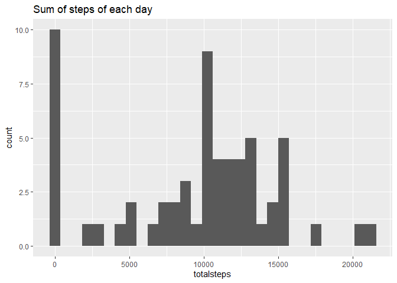
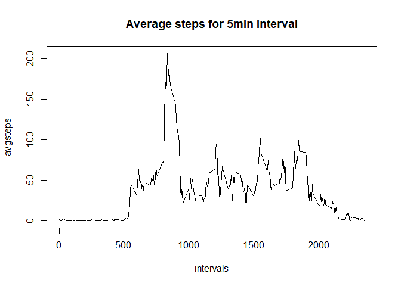
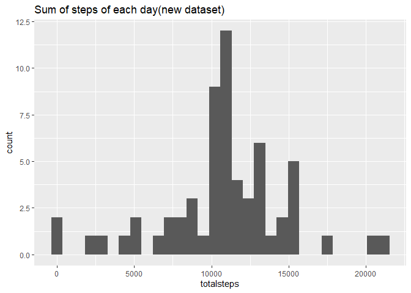
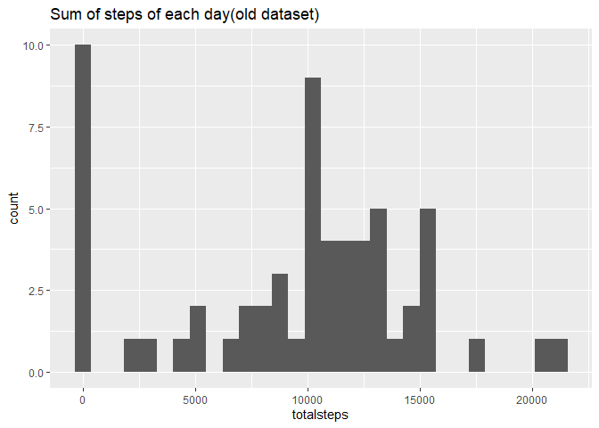
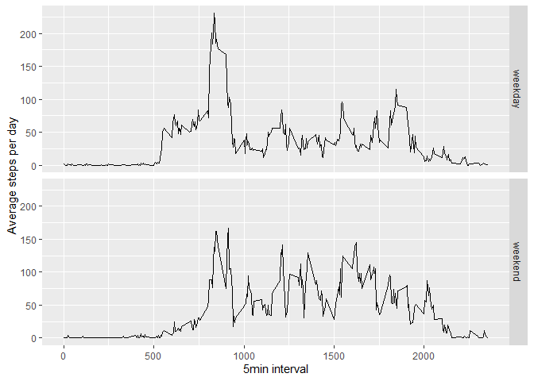

## Loading and preprocessing the data

```r
library(dslabs)
library(dplyr)
```

```
## 
## Attaching package: 'dplyr'
```

```
## The following objects are masked from 'package:stats':
## 
##     filter, lag
```

```
## The following objects are masked from 'package:base':
## 
##     intersect, setdiff, setequal, union
```

```r
library(ggplot2)
setwd("C:/Users/KARAN/Documents/R projects")
setwd("./reproducability-week2")
data=read.csv("activity.csv")
data$date=as.Date(data$date)
```


## What is mean total number of steps taken per day?
## Mean and Toatal steps per day

```r
data%>%group_by(date)%>%
  summarise(totalsteps=sum(steps,na.rm=T),mean=mean(steps,na.rm=T),median=median(steps,na.rm = T))%>%
  print()%>%
  ggplot(aes(totalsteps))+
  geom_histogram()+labs(title="Sum of steps of each day")
```

```
## # A tibble: 61 x 4
##    date       totalsteps    mean median
##    <date>          <int>   <dbl>  <dbl>
##  1 2012-10-01          0 NaN         NA
##  2 2012-10-02        126   0.438      0
##  3 2012-10-03      11352  39.4        0
##  4 2012-10-04      12116  42.1        0
##  5 2012-10-05      13294  46.2        0
##  6 2012-10-06      15420  53.5        0
##  7 2012-10-07      11015  38.2        0
##  8 2012-10-08          0 NaN         NA
##  9 2012-10-09      12811  44.5        0
## 10 2012-10-10       9900  34.4        0
## # ... with 51 more rows
```

```
## `stat_bin()` using `bins = 30`. Pick better value with `binwidth`.
```

<!-- -->


## What is the average daily activity pattern?

```r
avgsteps=as.numeric(tapply(data$steps,data$interval,mean,na.rm=T))
intervals=unique(data$interval)
plot(intervals,avgsteps,type="l",main="Average steps for 5min interval")
```

<!-- -->
The maximum avg steps for the interval is:

```r
intervals[which.max(avgsteps)]
```

```
## [1] 835
```


## Imputing missing values
The total number of NA's in the dataset are:

```r
sum(is.na(data$steps))
```

```
## [1] 2304
```
Imputing the missing values by their average 5min interval and creating a new dataset without any NA values:

```r
data1=cbind(data,avgsteps)
data1$steps[is.na(data1$steps)]=data1$avgsteps[is.na(data1$steps)]
head(data1)
```

```
##       steps       date interval  avgsteps
## 1 1.7169811 2012-10-01        0 1.7169811
## 2 0.3396226 2012-10-01        5 0.3396226
## 3 0.1320755 2012-10-01       10 0.1320755
## 4 0.1509434 2012-10-01       15 0.1509434
## 5 0.0754717 2012-10-01       20 0.0754717
## 6 2.0943396 2012-10-01       25 2.0943396
```
Histogram of the total steps per day from the new dataset and displaying the new mean and median:

```r
data1%>%group_by(date)%>%
  summarise(totalsteps=sum(steps,na.rm=T),mean=mean(steps,na.rm=T),median=median(steps,na.rm = T))%>%
  print()%>%
  ggplot(aes(totalsteps))+
  geom_histogram()+labs(title="Sum of steps of each day(new dataset)")
```

```
## # A tibble: 61 x 4
##    date       totalsteps   mean median
##    <date>          <dbl>  <dbl>  <dbl>
##  1 2012-10-01     10766. 37.4     34.1
##  2 2012-10-02       126   0.438    0  
##  3 2012-10-03     11352  39.4      0  
##  4 2012-10-04     12116  42.1      0  
##  5 2012-10-05     13294  46.2      0  
##  6 2012-10-06     15420  53.5      0  
##  7 2012-10-07     11015  38.2      0  
##  8 2012-10-08     10766. 37.4     34.1
##  9 2012-10-09     12811  44.5      0  
## 10 2012-10-10      9900  34.4      0  
## # ... with 51 more rows
```

```
## `stat_bin()` using `bins = 30`. Pick better value with `binwidth`.
```

<!-- -->
Comapring with the old dataset with NA values:


```r
data%>%group_by(date)%>%
  summarise(totalsteps=sum(steps,na.rm=T),mean=mean(steps,na.rm=T),median=median(steps,na.rm = T))%>%
  print()%>%
  ggplot(aes(totalsteps))+
  geom_histogram()+labs(title="Sum of steps of each day(old dataset)")
```

```
## # A tibble: 61 x 4
##    date       totalsteps    mean median
##    <date>          <int>   <dbl>  <dbl>
##  1 2012-10-01          0 NaN         NA
##  2 2012-10-02        126   0.438      0
##  3 2012-10-03      11352  39.4        0
##  4 2012-10-04      12116  42.1        0
##  5 2012-10-05      13294  46.2        0
##  6 2012-10-06      15420  53.5        0
##  7 2012-10-07      11015  38.2        0
##  8 2012-10-08          0 NaN         NA
##  9 2012-10-09      12811  44.5        0
## 10 2012-10-10       9900  34.4        0
## # ... with 51 more rows
```

```
## `stat_bin()` using `bins = 30`. Pick better value with `binwidth`.
```

<!-- -->
The impact of impuning missing values was huge in calculating the mean and median while the sum of steps per day remained relatively unchanged for each day
## Are there differences in activity patterns between weekdays and weekends?
###Comparing weekday and weekend trends 

```r
data2=data1
data2$day=weekdays(data2$date)
data2$day=ifelse(data2$day=="Saturday"|data2$day=="Sunday","weekend","weekday")
data2$day=factor(data2$day)
data2%>%group_by(interval,day)%>%summarise(avgday=mean(steps,na.rm=T))%>%ggplot(aes(x=interval,y=avgday),col=day)+geom_line()+facet_grid(day~.)+labs(x="5min interval",y="Average steps per day",main="weekdays Vs weekends")
```

<!-- -->

